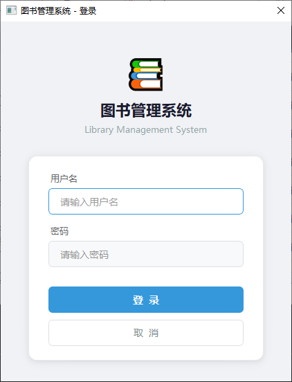
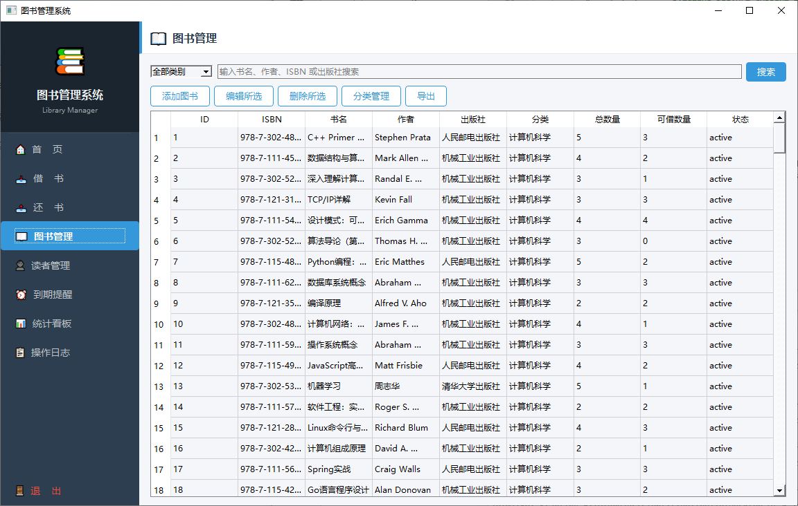
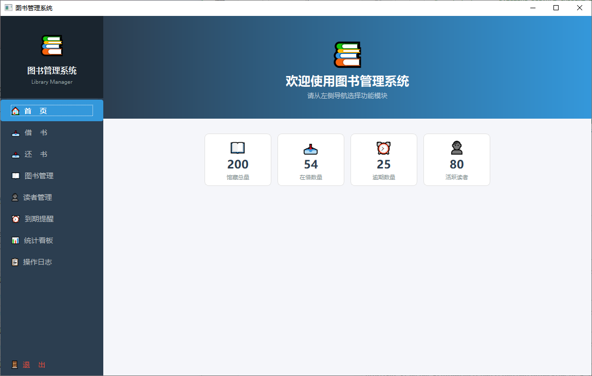

<!--
  ╔══════════════════════════════════════════════════════╗
  ║  📚  Library Management System — Qt6 + C++17 + MySQL  ║
  ╚══════════════════════════════════════════════════════╝
-->

<h1 align="center">
  📚 图书管理系统
  <br>
  <sub>Library Management System</sub>
</h1>

<p align="center">
  
  
  
  
  
</p>

<p align="center">
  <b>一个界面现代、功能完整的图书管理系统</b><br>
  借书 · 还书 · 图书管理 · 读者管理 · 到期提醒 · 统计看板 · 操作日志
</p>

---

## ✨ 特点

- 🎨 **现代 App 风格 UI** — 深色侧边栏导航 + QStackedWidget 单页面切换，侧边栏 hover/选中动画
- 🔐 **登录认证** — 卡片式登录界面，参数化查询防注入
- 📖 **图书管理** — 增删改查 + 分类筛选 + CSV 导出 + 软删除
- 👤 **读者管理** — 读者 CRUD + 冻结/解冻 + 借阅数追踪
- 📥📤 **借书/还书** — 数据库事务保证一致性 + 自动计算逾期罚款（0.5元/天）
- ⏰ **到期提醒** — 已逾期（红色）+ 即将到期（黄色）双标签页
- 📊 **统计看板** — 7 项实时指标，卡片式布局
- 📋 **操作日志** — 所有操作记录，含 IP 追踪
- 🏷️ **图书分类** — 可自定义分类，全局筛选
- 📁 **CSV 导出** — UTF-8 BOM，Excel 直接打开不乱码

## 🖼️ 截图

> 运行后截几张图放这里，瞬间提升 star 率 ⭐

<!--
  建议截图：
  1. 登录界面（卡片设计 + 阴影）
  2. 主界面（侧边栏导航 + 欢迎首页统计卡片）
  3. 图书管理（9 列表格 + 分类筛选）
  4. 借书界面（双 GroupBox 表单）
  5. 统计看板（7 指标卡片）
-->

| 登录 | 主界面 |
|:---:|:---:|
|  |  |

| 图书管理 | 统计看板 |
|:---:|:---:|
|  |  |

## 🛠️ 技术栈

| 层 | 技术 |
|---|------|
| 框架 | Qt 6.11.1 (Widgets) |
| 语言 | C++17 |
| 数据库 | MySQL 8.0 |
| 连接 | QODBC |
| 构建 | qmake + MinGW 64-bit |
| CI | GitHub Actions |

## 📁 项目结构

```
untitled1/
├── main.cpp                    # 入口：DB 连接 + schema 初始化 + 登录
├── mainmenu.h/.cpp             # 主窗口 Shell（侧边栏 + QStackedWidget）
├── logindialog.h/.cpp          # 登录对话框（卡片式 UI）
├── borrowwindow.h/.cpp         # 借书
├── returnwindow.h/.cpp         # 还书
├── bookmanagewindow.h/.cpp     # 图书 CRUD + 导出
├── addbookwindow.h/.cpp        # 添加图书
├── editbookdialog.h/.cpp       # 编辑图书
├── readermanagewindow.h/.cpp   # 读者 CRUD + 导出
├── readereditdialog.h/.cpp     # 添加/编辑读者
├── categorymanagedialog.h/.cpp # 分类管理
├── reminderwindow.h/.cpp       # 到期提醒
├── statswindow.h/.cpp          # 统计看板
├── logwindow.h/.cpp            # 操作日志
├── loghelper.h/.cpp            # 日志写入工具
├── untitled1.pro               # qmake 项目文件
└── CLAUDE.md                   # AI 辅助开发文档
```

## 🗄️ 数据库设计

```sql
-- 6 张核心表
users          (操作员：ID、用户名、密码、姓名、角色、状态)
readers        (读者：ID、证号、姓名、状态、借阅数)
books          (图书：ID、ISBN、书名、作者、出版社、分类、数量、状态)
categories     (分类：ID、名称)
borrow_records (借阅记录：ID、图书、读者、借还日期、状态、罚款)
operation_logs (操作日志：ID、操作员、类型、详情、IP、时间)
```

启动时 `ensureSchema()` 自动建表 + 种子数据，零手动配置。

## 🚀 快速开始

### 环境
- Windows 10/11
- Qt 6.11.1 (MinGW 64-bit)
- MySQL 8.0
- ODBC 数据源名称 `dbcd` → 指向 MySQL 数据库

### 配置数据库
```sql
CREATE DATABASE library;
-- 配置 ODBC DSN "dbcd" 指向 library 数据库
-- 用户 root / 密码 123456
```

### 构建
```powershell
# 设置环境
$env:Path = "D:\QT\6.11.1\mingw_64\bin;D:\QT\6.11.1\mingw_64\libexec;D:\QT\Tools\mingw1310_64\bin;" + $env:Path

# 构建
qmake untitled1.pro
mingw32-make -j4

# 运行
.\release\untitled1.exe
```

程序首次启动会自动创建所有表和种子数据。

## 🎯 核心业务规则

| 规则 | 说明 |
|------|------|
| 借阅期限 | 30 天 |
| 借阅上限 | 每读者最多 5 本 |
| 逾期罚款 | 0.5 元/天 |
| 软删除 | 图书/读者标记 status，不物理删除 |
| 借阅保护 | 有未还图书的读者不能冻结/删除 |
| 事务保证 | 借书/还书操作全程事务，失败自动回滚 |

## 🤝 贡献

欢迎提 Issue 和 PR。开发前请阅读 [CLAUDE.md](CLAUDE.md)。

## 📄 协议

MIT License — 详见 [LICENSE](LICENSE)
